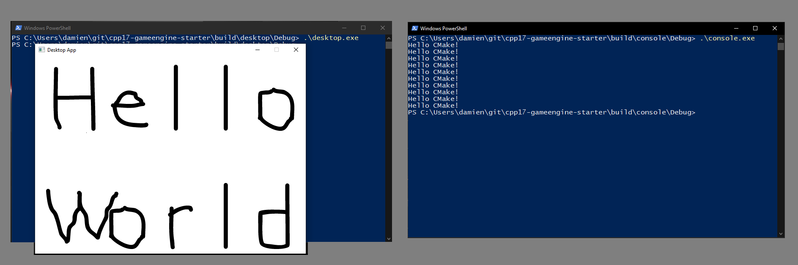
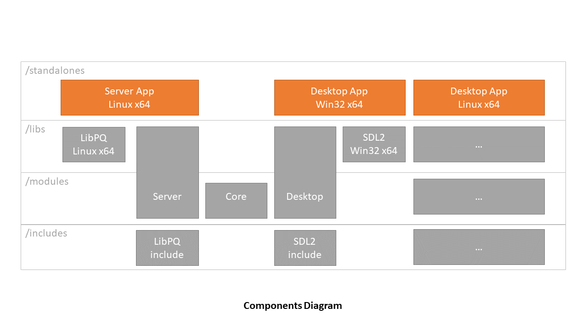
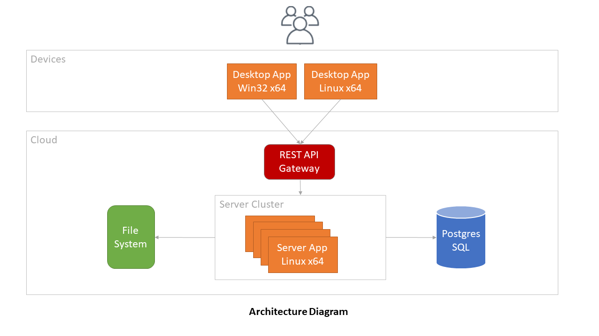

:warning: WORK IN PROGRESS
==========================

# C++ 17 - Starter

<p align="center">
  
</p>

## Content

- [Features](#features)
- [Dependencies](#dependencies)
- [Screenshots](#screenshots)
- [Install](#install)
- [Usage](#usage)
- [Resources](#resources)

---------------------------------------

## Features

- Stack
  - :heavy_check_mark: C++17
  - :heavy_check_mark: Standard libraries
  - :heavy_check_mark: Modularity
- Targets:
  - :x: x86 Windows
  - :x: x86 linux
  - :x: ARMv7 Android
- CI
  - :heavy_check_mark: CMake
  - :x: Formatter
  - :x: Code Analysis (Sonar)
  - :x: Unit Test
  - :x: Auto. Documentation

## Dependencies

- [SDL 2](https://www.libsdl.org/)
- [Miniz](https://github.com/richgel999/miniz)
- [ImGui](https://github.com/ocornut/imgui)

## Screenshots

<p align="center">
  
</p>





## Install

### Windows

CMake:
- Download the `v3.28.3` release of `CMake` at http://www.cmake.org/download/.
- Pick Windows (`Windows x64 Installer`).
- Run the installer
- When asked for, select `Add CMake to the system PATH for all users`.
- Run software installation...

Visual Studio:
- Download the `Community` version of `Visual Studio 2022` release of Visual Studio at https://visualstudio.microsoft.com/downloads/
- Run the installer...
- Run software `Visual Studio Installer`
- When asked for, click on `modify` under `Visual Studio 2002`
- Select `Desktop development with C++` (contains MVC package)
- Click on `modify`

PowerShell:
```powershell
cmake -S "modules/all" -B "build"
```

### Linux

:x:

## Usage

### Build everything at once

```bash
# Build
cmake -S "modules/all" -B "build"
cmake --build build

# run standalones
./build/standalone_server_win32_x64/Debug/standalone_server_win32_x64.exe
./build/standalone_desktop_win32_x64/Debug/standalone_desktop_win32_x64.exe
```

### Build and run the standalone target

```bash
# Build
cmake -S "modules/module_server" -B "build/module_server"
cmake --build "build/module_server"
```

### Build and run test suite

:x:

### Run clang-format

:x:

### Build the documentation

:x:

## FAQ

### How do I clean my temp files ?

```bash
git clean -d -f -x
```

## Resources

- Github
  - [ModernCppStarter](https://github.com/TheLartians/ModernCppStarter/tree/master)
